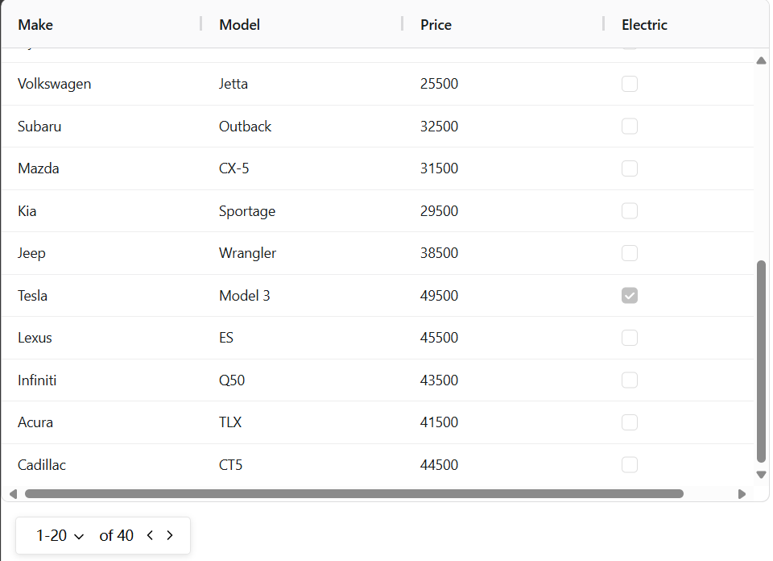
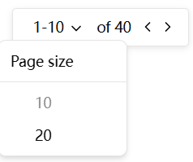

# ag-grid翻页器demo

[翻页器组件代码](src/components/PagingTab.vue)

翻页器接收2个参数，绑定1个数组：

- allData：后端返回的所有数据
- pageSize：页面大小，传入包含所有分页选项的数组
- v-model绑定表格中所展示的数据

⭐改动：

- 可点击的地方鼠标 hover 时显示可点击的鼠标样式，并且文字颜色变淡
- 分页器上面的文字设置为无法选中
- pageSize 改为传入包含所有分页选项的数组，通过v-for罗列出来供用户选择
- 翻页按钮在某单边到顶以后显示灰色，表示不可点击

效果展示：
点击下箭头或者其左侧文本都可以切换pageSize

> ps:目前使用v-model绑定表格中所展示的数组，通过修改该数组实现翻页逻辑。如果后端不是一次性返回所有数据，翻页时需要重新进行http请求或者其他操作，可以监听自定义事件prevPage和nextPage，处理翻页逻辑。